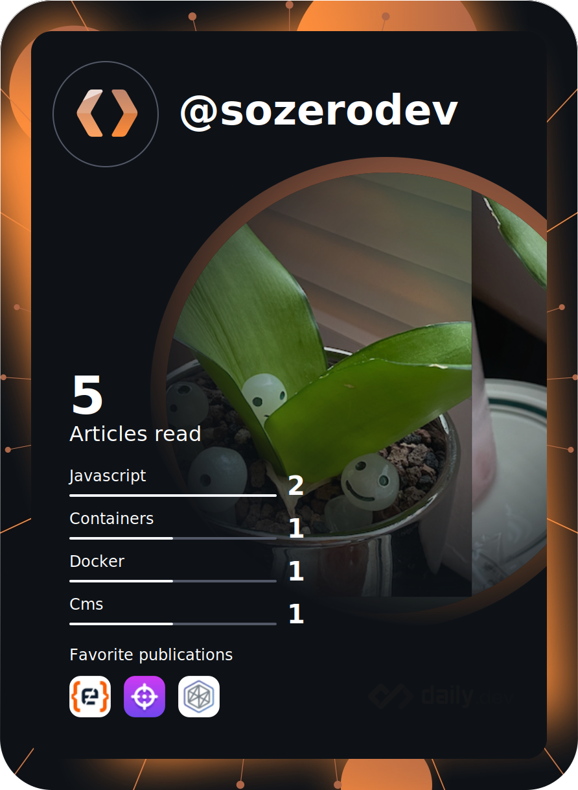

  

  # I'm soyoung kim 🙂
### Who Am I
- 🌱 I’m currently learning Computer Science for my better work experience
- 🌏 I majored in Geography 
- 🏙 I live in Seoul

### Experience
- 📚 Korea Open National University, Computer Science (in progress)
- ⛰ Heliosen, Web3D Team (2020.10 ~ 2023.04)
- 🎓 KyungHee University, Geography (Bachelor of Science) (2020.08)

### What I'm interested in
- Problem Solving Skills
- Node along with Typescript
- Code like Novel
- Utilizing geographic information for better user experience

### if you want more information
- You can see my blog post [here!](https://sozerodev.tistory.com/)
- You can contact me on here, <sozerodev@gmail.com>

  

  

